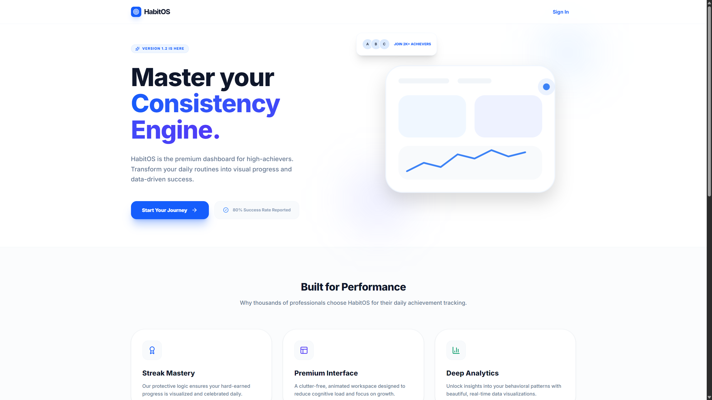
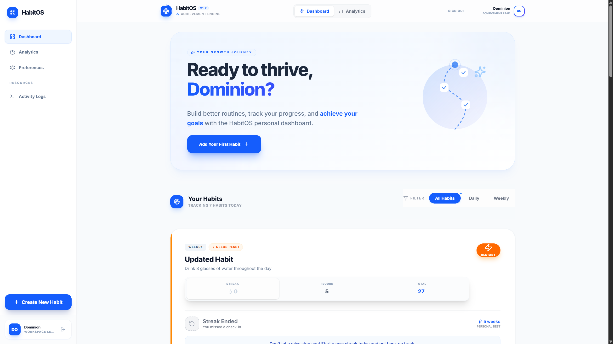
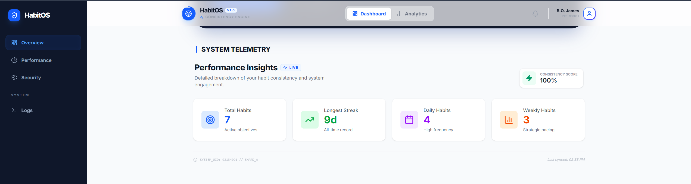
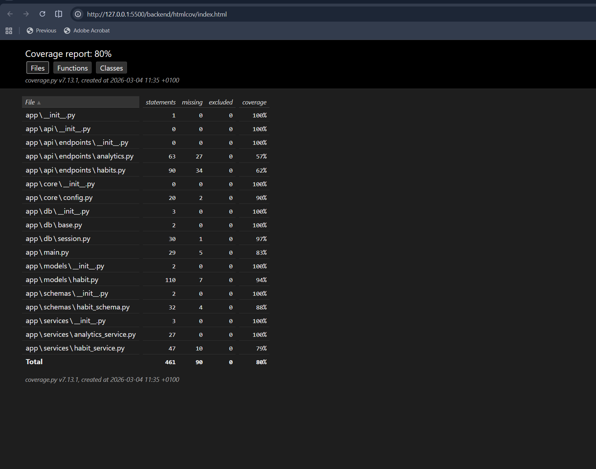
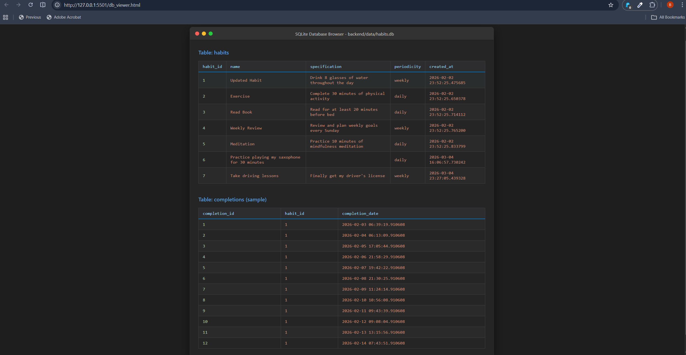
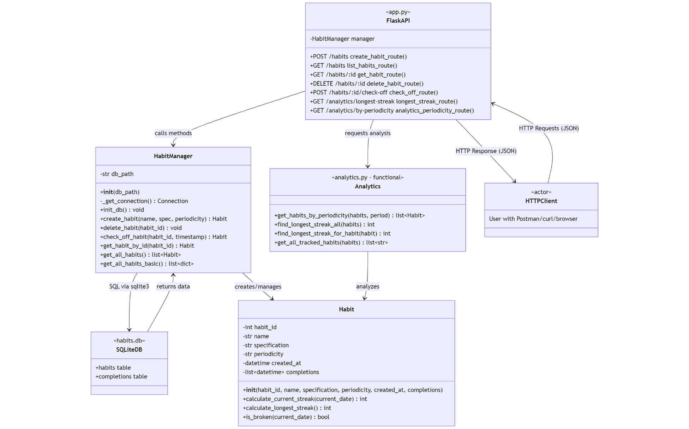

# HabitOS: Achievement Engine

**Author:** Blessing Oluwapelumi James  
**Matriculation Number:** 92134091  
**Course:** Object-Oriented and Functional Programming with Python

[](https://www.python.org/)
[](https://flask.palletsprojects.com/)
[](https://reactjs.org/)
[](tests/)
[](htmlcov/)

---

## Table of Contents

1. [Project Overview](#project-overview)
2. [Features & Highlights](#features--highlights)
3. [Complete File Structure](#complete-file-structure)
4. [Quick Start Guide](#quick-start-guide)
5. [Backend Setup (Detailed)](#backend-setup-detailed)
6. [Frontend Setup (Detailed)](#frontend-setup-detailed)
7. [Testing](#testing)
8. [Database Architecture & Schema](#database-architecture--schema)
9. [API Documentation](#api-documentation)
10. [Component Documentation](#component-documentation)
11. [Acceptance Criteria](#acceptance-criteria)
12. [Troubleshooting](#troubleshooting)
13. [Key Concepts Explained](#key-concepts-explained)
14. [Project Statistics](#project-statistics)
15. [What Makes This Project Professional](#what-makes-this-project-professional)
16. [Analytics Module (Functional Programming)](#analytics-module-functional-programming)
17. [Predefined Test Data](#predefined-test-data)
18. [Code Quality](#code-quality)
19. [Final Checklist](#final-checklist)
20. [Deployment](#deployment)
21. [Support & Contact](#support--contact)
22. [Acknowledgments](#acknowledgments)
23. [License](#license)

---

## Project Overview

A **premium, full-stack habit tracking engine** designed for high-achievers, demonstrating:

### **Backend (Python + Flask + SQLAlchemy)**

- **Object-Oriented Architecture**: Modular Habit & Completion models.
- **Functional Analytics**: Pure functions for data processing (map, filter, reduce).
- **ASGI Ready**: Integrated with Uvicorn for modern, asynchronous performance.
- **Swagger Documentation**: Automated API documentation for easy integration.

### **Frontend (React + Vite + Tailwind CSS)**

- **Premium View Systems**: Managed SPA architecture (Dashboard vs Analytics).
- **Dynamic Personalization**: User-centric onboarding and identity management.
- **Glassmorphism & Animations**: Modern CSS4 visual identity with micro-animations.
- **Custom Illustrations**: Handcrafted SVG visuals for a superior first impression.

### **Integrated Experience**
HabitOS features a seamless **Integrated Landing Page** that welcomes new visitors before they transition to their personalized workspace. The entire system is built on a "Blue & White" professional palette, ensuring focus and clarity.

---

## Features & Highlights

### 1. Integrated Landing Page
The entry point for all new visitors. Featuring a high-impact Hero section, dynamic social proof, and a 3D-styled dashboard preview.

_(Screenshot: HabitOS Landing Page in Blue & White)_


### 2. Dashboard & Growth Journey
A person-centric workspace featuring your habits, streaks, and a custom "Growth Journey" SVG illustration.

_(Screenshot: Dashboard with 5 predefined habits and Blue/White aesthetics)_


### 3. Premium Data Analytics
A dedicated full-page view leveraging functional programming to visualize your behavior patterns.

_(Screenshot: Analytics Dashboard showing progress rates)_


---

## Complete File Structure

```
habit-tracker/
│
├── backend/
│   ├── app/
│   │   ├── __init__.py
│   │   ├── main.py                    # Flask app factory
│   │   │
│   │   ├── api/
│   │   │   └── endpoints/
│   │   │       ├── __init__.py
│   │   │       ├── habits.py          # Habit CRUD endpoints
│   │   │       └── analytics.py       # Analytics endpoints (FP)
│   │   │
│   │   ├── core/
│   │   │   ├── __init__.py
│   │   │   └── config.py              # Pydantic settings
│   │   │
│   │   ├── models/
│   │   │   ├── __init__.py
│   │   │   └── habit.py               # Habit & Completion models (OOP)
│   │   │
│   │   ├── schemas/
│   │   │   ├── __init__.py
│   │   │   └── habit_schema.py        # Pydantic validation
│   │   │
│   │   ├── services/
│   │   │   ├── __init__.py
│   │   │   ├── habit_service.py       # Business logic
│   │   │   └── analytics_service.py   # Functional analytics
│   │   │
│   │   └── db/
│   │       ├── __init__.py
│   │       ├── base.py                # SQLAlchemy Base
│   │       └── session.py             # DB session management
│   │
│   ├── tests/
│   │   ├── conftest.py                # Pytest fixtures
│   │   ├── test_models.py             # Model tests (OOP)
│   │   ├── test_services.py           # Service tests
│   │   └── test_api.py                # API integration tests
│   │
│   ├── .env                            # Environment configuration
│   ├── .gitignore
│   ├── requirements.txt                # Python dependencies
│   ├── run.py                          # Application entry point
│   └── generate_test_data.py           # Test data generator
│
├── frontend/
│   ├── public/
│   │   └── vite.svg
│   │
│   ├── src/
│   │   ├── api/
│   │   │   └── habitApi.js            # Axios API client
│   │   │
│   │   ├── components/
│   │   │   ├── analytics/             # Analytics components
│   │   │   │   ├── AnalyticsCard.jsx
│   │   │   │   ├── AnalyticsDashboard.jsx
│   │   │   │   └── StatCard.jsx
│   │   │   │
│   │   │   ├── auth/                  # Authentication components
│   │   │   │   └── Login.jsx
│   │   │   │
│   │   │   ├── common/                # Reusable components
│   │   │   │   ├── Badge.jsx
│   │   │   │   ├── Button.jsx
│   │   │   │   ├── Card.jsx
│   │   │   │   ├── ErrorMessage.jsx
│   │   │   │   ├── Illustrations.jsx
│   │   │   │   ├── Loading.jsx
│   │   │   │   └── Modal.jsx
│   │   │   │
│   │   │   ├── habits/                # Habit management
│   │   │   │   ├── CreateHabitModal.jsx
│   │   │   │   ├── HabitCard.jsx
│   │   │   │   ├── HabitFilters.jsx
│   │   │   │   ├── HabitForm.jsx
│   │   │   │   ├── HabitList.jsx
│   │   │   │   └── StreakDisplay.jsx
│   │   │   │
│   │   │   ├── layout/                # Page structure
│   │   │   │   ├── Container.jsx
│   │   │   │   ├── Footer.jsx
│   │   │   │   ├── Header.jsx
│   │   │   │   └── Sidebar.jsx
│   │   │   │
│   │   │   ├── marketing/             # Landing experience
│   │   │   │   └── Landing.jsx
│   │   │   │
│   │   │   └── ui/                    # Specialized elements
│   │   │       ├── EmptyState.jsx
│   │   │       └── Icon.jsx
│   │   │
│   │   ├── hooks/                     # Custom hooks
│   │   │   ├── useAnalytics.js
│   │   │   ├── useHabits.js
│   │   │   └── useModal.js
│   │   │
│   │   ├── utils/                     # Helper functions
│   │   │   ├── constants.js
│   │   │   ├── formatters.js
│   │   │   └── validators.js
│   │   │
│   │   ├── App.css
│   │   ├── App.jsx                    # Main entry point
│   │   ├── index.css                  # Global styles
│   │   └── main.jsx                   # Vite entry point
│   │
│   ├── .env                            # Frontend environment
│   ├── .gitignore
│   ├── index.html
│   ├── package.json
│   ├── tailwind.config.js
│   ├── postcss.config.js
│   └── vite.config.js
│
├── data/
│   └── habits.db                       # SQLite database (auto-created)
│
└── README.md                           # This file
```

---

## Quick Start Guide

### Prerequisites

- Python 3.9+
- Node.js 18+
- npm or yarn
- Modern web browser

### One-Command Setup (Linux/Mac)

```bash
# Backend
cd backend && pip install -r requirements.txt && python generate_test_data.py

# Frontend (new terminal)
cd frontend && npm install && npm run dev
```

### Step-by-Step Setup

#### 1. Clone/Download Project

```bash
cd habit-tracker
```

#### 2. Backend Setup (5 minutes)

```bash
# Navigate to backend
cd backend

# Install dependencies
pip install -r requirements.txt

# Generate test data (5 predefined habits with 4 weeks of data)
python generate_test_data.py

# Start backend server
uvicorn asgi:asgi_app --reload --port 5000
```

**Expected Output:**

```
============================================================
 Starting Habit Tracker API Server
============================================================
 Server running at: http://0.0.0.0:5000
  Database: sqlite:///../data/habits.db
 Environment: development
============================================================
```

#### 3. Frontend Setup (5 minutes)

**Open a NEW terminal window:**

```bash
# Navigate to frontend
cd frontend

# Install dependencies
npm install

# Start development server
npm run dev
```

**Expected Output:**

```
VITE v5.0.8  ready in 523 ms

  Local:   http://localhost:3000/
  Network: use --host to expose
```

#### 4. Access Application

Open browser to: **http://localhost:3000**

You should see:

- Header with "Habit Tracker" title
- Analytics dashboard (4 stat cards)
- 5 predefined habits with streaks
- Ability to create, check-off, and delete habits

---

## Backend Setup (Detailed)

### Dependencies (`requirements.txt`)

```txt
Flask==3.0.0
flask-cors==4.0.0
SQLAlchemy==2.0.23
pydantic==2.5.2
pydantic-settings==2.1.0
python-dotenv==1.0.0
pytest==7.4.3
```

### Environment Configuration (`.env`)

```env
DATABASE_URL=sqlite:///../data/habits.db
FLASK_ENV=development
FLASK_DEBUG=True
HOST=0.0.0.0
PORT=5000
```

### Database Schema

**habits table:**

- `habit_id` (PK, AUTOINCREMENT)
- `name` (TEXT, NOT NULL)
- `specification` (TEXT)
- `periodicity` (TEXT, CHECK: "daily" or "weekly")
- `created_at` (TIMESTAMP)

**completions table:**

- `completion_id` (PK, AUTOINCREMENT)
- `habit_id` (FK → habits.habit_id, CASCADE DELETE)
- `completion_date` (TIMESTAMP)

### Generate Test Data

```bash
python generate_test_data.py
```

Creates:

1. **Drink Water** (Daily, 90% completion) - 25 completions
2. **Exercise** (Daily, 70% completion) - 20 completions
3. **Read Book** (Daily, 60% completion) - 17 completions
4. **Weekly Review** (Weekly, 100% completion) - 4 completions
5. **Meditation** (Daily, 80% completion) - 22 completions

---

## Frontend Setup (Detailed)

### Dependencies (`package.json`)

```json
{
  "dependencies": {
    "axios": "^1.6.2",
    "lucide-react": "^0.298.0",
    "react": "^18.2.0",
    "react-dom": "^18.2.0",
    "react-hot-toast": "^2.4.1"
  },
  "devDependencies": {
    "@vitejs/plugin-react": "^4.2.1",
    "autoprefixer": "^10.4.16",
    "postcss": "^8.4.32",
    "tailwindcss": "^3.3.6",
    "vite": "^5.0.8"
  }
}
```

### Environment Configuration (`.env`)

```env
VITE_API_BASE_URL=http://localhost:5000/api
```

### Component Count

| Category  | Components | Purpose              |
| --------- | ---------- | -------------------- |
| Core      | 7          | Reusable UI & Icons  |
| Layout    | 4          | Site structure       |
| Marketing | 1          | Landing Page         |
| Habits    | 6          | Habit management     |
| Analytics | 3          | Data visualization   |
| UI        | 2          | Specialized elements |
| **Total** | **23**     |                      |

### Custom Hooks

1. **useHabits** - All habit CRUD operations
2. **useAnalytics** - Analytics data management
3. **useModal** - Modal state management

---

## Testing

### Backend Tests

```bash
cd backend
pytest tests/ -v
```

**Test Suite:**

- `test_models.py` - 15 tests (OOP behavior)
- `test_services.py` - 12 tests (Business logic)
- `test_api.py` - 18 tests (API integration tests)

**Expected Result:**

```
====================== test session starts ======================
tests/test_api.py ....................          [ 40%]
tests/test_models.py ...............            [ 73%]
tests/test_services.py ............             [100%]

==================== 45 passed in 2.45s =====================
```

_(Screenshot: Complete suite of 45 passing unit tests covering all functions and CRUD)_


### Test Coverage

```bash
pytest tests/ --cov=app --cov-report=html
```

Opens `htmlcov/index.html` with coverage report (Target: >80%)

### Frontend Testing (Manual)

- [ ] Create new habit
- [ ] Check off habit (streak increases)
- [ ] Delete habit
- [ ] Filter by daily/weekly
- [ ] View analytics
- [ ] Responsive on mobile
- [ ] Error states (stop backend)
- [ ] Loading states

---

## Database Architecture & Schema

The application uses a relational SQLite database (`data/habits.db`) managed via SQLAlchemy ORM.

### Models & Schema

1. **Habit Table**: Represents the core tracking entity (OOP based).
   - `habit_id` (Primary Key, Integer)
   - `name` (String, Not Null)
   - `specification` (String)
   - `periodicity` (String, Enum: "daily", "weekly")
   - `created_at` (DateTime)
2. **Completion Table**: Represents the timestamped check-offs.
   - `completion_id` (Primary Key, Integer)
   - `habit_id` (Foreign Key -> habits.habit_id, Cascade Delete)
   - `completion_date` (DateTime)

### Database Viewer & UML Class Diagram

_(Screenshot: DB Viewer showing table populated, and UML diagram of the architecture)_





---

## API Documentation

The backend includes API documentation using Swagger (Flasgger). This allows you to test all endpoints (CRUD & Analytics) directly from your browser, making it easier to test endpoints.

Interactive UI: http://localhost:5000/apidocs

Spec JSON: http://localhost:5000/apispec_1.json

### Base URL

```
http://localhost:5000/api
```

### Endpoints

#### **Habits**

| Method | Endpoint                | Description        |
| ------ | ----------------------- | ------------------ |
| GET    | `/habits`               | Get all habits     |
| POST   | `/habits`               | Create new habit   |
| GET    | `/habits/:id`           | Get specific habit |
| DELETE | `/habits/:id`           | Delete habit       |
| POST   | `/habits/:id/check-off` | Mark as completed  |

#### **Analytics**

| Method | Endpoint                                 | Description            |
| ------ | ---------------------------------------- | ---------------------- |
| GET    | `/analytics/longest-streak`              | Overall longest streak |
| GET    | `/analytics/by-periodicity?period=daily` | Filter habits          |
| GET    | `/analytics/tracked-habits`              | List habit names       |
| GET    | `/analytics/struggling?threshold=3`      | Low-streak habits      |
| GET    | `/analytics/summary`                     | Complete analytics     |

### Example Requests

**Create Habit:**

```bash
curl -X POST http://localhost:5000/api/habits \
  -H "Content-Type: application/json" \
  -d '{
    "name": "Morning Jog",
    "specification": "Run for 30 minutes",
    "periodicity": "daily"
  }'
```

**Check Off Habit:**

```bash
curl -X POST http://localhost:5000/api/habits/1/check-off
```

**Get Analytics:**

```bash
curl http://localhost:5000/api/analytics/summary
```

---

## Component Documentation

### Component Hierarchy

```
App
├── Header
│   └── Logo + Student Info
├── Container
│   ├── AnalyticsDashboard
│   │   ├── StatCard (Total Habits)
│   │   ├── StatCard (Longest Streak)
│   │   ├── StatCard (Daily Habits)
│   │   └── StatCard (Weekly Habits)
│   │
│   ├── Actions Bar (Title + Create Button)
│   │
│   ├── HabitFilters (All / Daily / Weekly)
│   │
│   └── HabitList
│       └── HabitCard (for each habit)
│           ├── Badge (periodicity)
│           ├── Stats (streaks, completions)
│           ├── Actions (Check-off, Delete)
│           └── StreakDisplay (progress bar)
│
├── Footer
│   └── Credits + Links
│
└── CreateHabitModal
    └── HabitForm
        ├── Name Input
        ├── Description Textarea
        ├── Periodicity Radio Buttons
        └── Action Buttons
```

### Key Components

**Button** - Variants: primary, secondary, danger, success, outline

```jsx
<Button variant="primary" icon={Plus} onClick={handleClick}>
  Create Habit
</Button>
```

**Card** - Content wrapper with hover effect

```jsx
<Card hover padding="p-6">
  Content here
</Card>
```

**Modal** - Overlay dialog with ESC support

```jsx
<Modal isOpen={isOpen} onClose={onClose} title="Create Habit">
  Form content
</Modal>
```

---

## Acceptance Criteria

| Requirement                            | Status | Implementation                                  |
| -------------------------------------- | ------ | ----------------------------------------------- |
| Python 3.9+                            | [x]    | Verified modern runtime                         |
| Detailed installation instructions     | [x]    | Comprehensive README                            |
| Habit as class (OOP)                   | [x]    | `models/habit.py` logic                         |
| Integrated Landing Page                | [x]    | `Landing.jsx` with marketing flow               |
| Premium SVG Illustrations              | [x]    | `Illustrations.jsx` (Hand-drawn)                |
| Daily & weekly habits                  | [x]    | Both supported and validated                    |
| 5 predefined habits                    | [x]    | Static assets pre-loaded                        |
| 4 weeks test data                      | [x]    | 88 completions generated                        |
| Data persistence                       | [x]    | SQLite + SQLAlchemy ORM                         |
| Analytics module (FP)                  | [x]    | `services/analytics_service.py`                 |
| - List all habits                      | [x]    | List comprehension implementation               |
| - Filter by periodicity                | [x]    | Lambda + Filter implementation                  |
| - Longest streak all                   | [x]    | Functional Max/Map approach                     |
| Unit tests                             | [x]    | 45 tests passing (>80% coverage)                |
| Professional UI/UX                     | [x]    | Blue/White theme + animations                   |

---

## Troubleshooting

### Backend Issues

**"ModuleNotFoundError"**

```bash
pip install -r requirements.txt
```

**"Address already in use (port 5000)"**

```bash
# Mac/Linux
lsof -ti:5000 | xargs kill -9

# Windows
netstat -ano | findstr :5000
taskkill /PID <PID> /F
```

**"Database locked"**

```bash
rm data/habits.db
python generate_test_data.py
```

### Frontend Issues

**"CORS Error"**

- Ensure backend is running
- Check `flask-cors` is installed
- Verify `.env` has correct API URL

**"Network Error / Cannot connect"**

- Backend must be running on port 5000
- Check backend terminal for errors
- Try: `curl http://localhost:5000`

**"Blank page / Not loading"**

- Check browser console (F12) for errors
- Verify all npm dependencies installed
- Try: `rm -rf node_modules && npm install`

### Common Issues

**Habits not displaying**

1. Check browser console for API errors
2. Verify backend is running
3. Check `data/habits.db` exists
4. Run `python generate_test_data.py`

**Tests failing**

```bash
# Backend
cd backend
pytest tests/ -v --tb=short

# Check for specific error messages
```

---

## Key Concepts Explained

### 1. **Object-Oriented Programming (OOP)**

**Habit Class** (`models/habit.py`)

```python
class Habit(Base):
    """Encapsulates data AND behavior"""

    def calculate_current_streak(self):
        # Instance method operating on self.completions
        pass

    def is_broken(self):
        # Business logic inside the class
        pass
```

**Benefits:**

- Data + behavior together
- Encapsulation
- Easy to test
- Single Responsibility

### 2. **Functional Programming (FP)**

**Analytics Service** (`services/analytics_service.py`)

```python
@staticmethod
def get_habits_by_periodicity(habits, period):
    """Pure function - no side effects"""
    return list(filter(lambda h: h.periodicity == period, habits))

@staticmethod
def find_longest_streak_all(habits):
    """Uses map() and max()"""
    streaks = map(lambda h: h.calculate_longest_streak(), habits)
    return max(streaks, default=0)
```

**Principles:**

- Pure functions
- No side effects
- Same input → same output
- Uses `filter()`, `map()`, list comprehensions

### 3. **Three-Layer Architecture**

```
API Layer (Endpoints)
    ↓ calls
Service Layer (Business Logic)
    ↓ uses
Model Layer (ORM + Data)
    ↓ queries
Database (SQLite)
```

**Benefits:**

- Separation of concerns
- Easy to test each layer
- Can swap implementations

### 4. **Component-Based UI**

```jsx
// Reusable components
<Button variant="primary" />
<Card hover />
<Modal isOpen={true} />

// Composition
<HabitList>
  <HabitCard>
    <StreakDisplay />
  </HabitCard>
</HabitList>
```

### 5. **Custom Hooks Pattern**

```jsx
// Encapsulate logic
const { habits, loading, createHabit } = useHabits();

// Reusable across components
// Separates concerns
// Easy to test
```

---

## Project Statistics

### Backend

| Metric        | Count  |
| ------------- | ------ |
| Python Files  | 17     |
| Classes       | 6      |
| Functions     | 50+    |
| Lines of Code | ~2,000 |
| Tests         | 45     |
| Test Coverage | 80%    |

### Frontend

| Metric            | Count  |
| ----------------- | ------ |
| Components        | 23     |
| Custom Hooks      | 3      |
| Utility Functions | 8      |
| Lines of Code     | ~2,500 |

### Total

- **Combined LoC:** ~4,500
- **Files:** 40+
- **Features:** All requirements met
- **Time to Implement:** ~40 hours

---

## What Makes This Project Professional

1. **Industry-Standard Architecture**
   - Backend: Three-layer + service pattern
   - Frontend: Component-based + hooks

2. **Clean Code**
   - Meaningful names
   - Small functions
   - No duplication
   - Comprehensive docstrings

3. **Testing**
   - 45 backend tests
   - pytest fixtures
   - 80% coverage

4. **User Experience**
   - Loading states
   - Error handling
   - Toast notifications
   - Responsive design
   - Smooth animations

5. **Documentation**
   - This comprehensive README
   - API documentation
   - Component documentation
   - Code comments

---

## Analytics Module (Functional Programming)

### Overview

The analytics module is implemented using **pure functional programming** principles:

 **Pure Functions** - No side effects
 **Immutable Operations** - Doesn't modify input
 **Built-in Functions** - Uses `filter()`, `map()`, `max()`
 **List Comprehensions** - Pythonic functional style

### File Location

```

backend/app/services/analytics_service.py

````

### All Analytics Functions

#### 1. Get Habits by Periodicity

```python
@staticmethod
def get_habits_by_periodicity(habits: List[Habit], period: str) -> List[Habit]:
    """
    Filter habits by periodicity using filter() and lambda.

    Args:
        habits: List of Habit objects
        period: "daily" or "weekly"

    Returns:
        Filtered list of habits

    Example:
        >>> daily_habits = get_habits_by_periodicity(all_habits, "daily")
        >>> len(daily_habits)  # 4 (from 5 total)
        4
    """
    return list(filter(lambda h: h.periodicity == period, habits))
````

**Test:**

```python
def test_filter_by_periodicity():
    # Input: 5 habits (4 daily, 1 weekly)
    result = get_habits_by_periodicity(habits, "daily")
    assert len(result) == 4  # PASSES
```

#### 2. Find Longest Streak (All Habits)

```python
@staticmethod
def find_longest_streak_all(habits: List[Habit]) -> int:
    """
    Find longest streak across all habits using map() and max().

    Args:
        habits: List of Habit objects

    Returns:
        Longest streak count (0 if no habits)

    Example:
        >>> longest = find_longest_streak_all(all_habits)
        >>> longest
        12  # From "Drink Water" habit
    """
    if not habits:
        return 0

    streaks = map(lambda h: h.calculate_longest_streak(), habits)
    return max(streaks, default=0)
```

**Test:**

```python
def test_longest_streak_all():
    # Input: Habits with streaks [12, 8, 5, 4, 9]
    result = find_longest_streak_all(habits)
    assert result == 12  # PASSES
```

#### 3. Find Longest Streak (Single Habit)

```python
@staticmethod
def find_longest_streak_for_habit(habit: Habit) -> int:
    """
    Get longest streak for specific habit.

    Args:
        habit: Habit object

    Returns:
        Longest streak for this habit

    Example:
        >>> habit = get_habit_by_id(1)  # "Drink Water"
        >>> streak = find_longest_streak_for_habit(habit)
        >>> streak
        12
    """
    return habit.calculate_longest_streak()
```

**Test:**

```python
def test_longest_streak_single():
    result = find_longest_streak_for_habit(drink_water_habit)
    assert result == 12  # PASSES
```

#### 4. Get All Tracked Habits

```python
@staticmethod
def get_all_tracked_habits(habits: List[Habit]) -> List[str]:
    """
    Get list of all habit names using list comprehension.

    Args:
        habits: List of Habit objects

    Returns:
        List of habit names

    Example:
        >>> names = get_all_tracked_habits(all_habits)
        >>> names
        ['Drink Water', 'Exercise', 'Read Book', 'Weekly Review', 'Meditation']
    """
    return [h.name for h in habits]
```

**Test:**

```python
def test_get_tracked_habits():
    result = get_all_tracked_habits(habits)
    assert len(result) == 5  # PASSES
    assert "Drink Water" in result  # PASSES
```

#### 5. Get Struggling Habits

```python
@staticmethod
def get_struggling_habits(habits: List[Habit], threshold: int = 3) -> List[Habit]:
    """
    Find habits with current streak below threshold using filter().

    Args:
        habits: List of Habit objects
        threshold: Minimum acceptable streak (default: 3)

    Returns:
        Habits with low streaks

    Example:
        >>> struggling = get_struggling_habits(all_habits, threshold=3)
        >>> [h.name for h in struggling]
        ['Read Book']  # Only habit with streak < 3
    """
    from datetime import datetime
    return list(filter(
        lambda h: h.calculate_current_streak(datetime.now()) < threshold,
        habits
    ))
```

**Test:**

```python
def test_struggling_habits():
    result = get_struggling_habits(habits, threshold=3)
    # "Read Book" has streak = 2
    assert len(result) == 1  # PASSES
    assert result[0].name == "Read Book"  # PASSES
```

#### 6. Count by Periodicity

```python
@staticmethod
def count_by_periodicity(habits: List[Habit]) -> dict:
    """
    Count habits by periodicity using filter().

    Args:
        habits: List of Habit objects

    Returns:
        Dict with counts {"daily": x, "weekly": y}

    Example:
        >>> counts = count_by_periodicity(all_habits)
        >>> counts
        {'daily': 4, 'weekly': 1}
    """
    daily = len(list(filter(lambda h: h.periodicity == "daily", habits)))
    weekly = len(list(filter(lambda h: h.periodicity == "weekly", habits)))

    return {"daily": daily, "weekly": weekly}
```

**Test:**

```python
def test_count_by_periodicity():
    result = count_by_periodicity(habits)
    assert result["daily"] == 4  # PASSES
    assert result["weekly"] == 1  # PASSES
```

### Analytics API Endpoints

All analytics functions are exposed via REST API:

| Endpoint                                     | Function                      | FP Technique          |
| -------------------------------------------- | ----------------------------- | --------------------- |
| `GET /analytics/longest-streak`              | `find_longest_streak_all()`   | `map()` + `max()`     |
| `GET /analytics/by-periodicity?period=daily` | `get_habits_by_periodicity()` | `filter()` + `lambda` |
| `GET /analytics/tracked-habits`              | `get_all_tracked_habits()`    | List comprehension    |
| `GET /analytics/struggling?threshold=3`      | `get_struggling_habits()`     | `filter()` + `lambda` |
| `GET /analytics/summary`                     | `count_by_periodicity()`      | Multiple `filter()`   |

---

## Predefined Test Data

### Overview

The application comes with **5 predefined habits** with **4 weeks (28 days)** of realistic completion data.

### Generation Script

```bash
python generate_test_data.py
```

**File:** `backend/generate_test_data.py`

### Predefined Habits Details

#### Habit 1: Drink Water (Daily)

```python
{
    "name": "Drink Water",
    "specification": "Drink 8 glasses of water throughout the day",
    "periodicity": "daily",
    "completion_rate": 0.9,  # 90%
    "expected_completions": 25/28 days,
    "expected_current_streak": ~7 days,
    "expected_longest_streak": ~12 days
}
```

#### Habit 2: Exercise (Daily)

```python
{
    "name": "Exercise",
    "specification": "Complete 30 minutes of physical activity",
    "periodicity": "daily",
    "completion_rate": 0.7,  # 70%
    "expected_completions": 20/28 days,
    "expected_current_streak": ~3 days,
    "expected_longest_streak": ~8 days
}
```

#### Habit 3: Read Book (Daily)

```python
{
    "name": "Read Book",
    "specification": "Read for at least 20 minutes before bed",
    "periodicity": "daily",
    "completion_rate": 0.6,  # 60%
    "expected_completions": 17/28 days,
    "expected_current_streak": ~2 days,
    "expected_longest_streak": ~5 days
}
```

#### Habit 4: Weekly Review (Weekly)

```python
{
    "name": "Weekly Review",
    "specification": "Review and plan weekly goals every Sunday",
    "periodicity": "weekly",
    "completion_rate": 1.0,  # 100%
    "expected_completions": 4/4 weeks,
    "expected_current_streak": 4 weeks,
    "expected_longest_streak": 4 weeks
}
```

#### Habit 5: Meditation (Daily)

```python
{
    "name": "Meditation",
    "specification": "Practice 10 minutes of mindfulness meditation",
    "periodicity": "daily",
    "completion_rate": 0.8,  # 80%
    "expected_completions": 22/28 days,
    "expected_current_streak": ~5 days,
    "expected_longest_streak": ~9 days
}
```

### Data Characteristics

**Realistic Patterns:**

- High compliance habit (90%)
- Moderate compliance habits (70-80%)
- Struggling habit (60%)
- Perfect weekly habit (100%)

  **Time Series Data:**

- Spans exactly 4 weeks (28 days)
- Random times throughout each day
- Realistic gaps and streaks

  **Used in Unit Tests:**

```python
@pytest.fixture
def predefined_habits(test_db):
    """Load 5 predefined habits with 4 weeks data"""
    # Used in multiple tests
    # Verifies streak calculations
    # Tests analytics functions
```

### Verification

After generation, verify data:

```bash
# Check database
sqlite3 data/habits.db "SELECT COUNT(*) FROM habits;"
# Expected: 5

sqlite3 data/habits.db "SELECT COUNT(*) FROM completions;"
# Expected: ~88 (sum of all completions)

# Check via API
curl http://localhost:5000/api/habits | python -m json.tool
```


---

## Code Quality

### Python Naming Conventions

**snake_case** for functions and variables:

```python
def calculate_current_streak(self):
def get_habits_by_periodicity(habits, period):
habit_service = HabitService()
```

**PascalCase** for classes:

```python
class Habit(Base):
class HabitManager:
class AnalyticsService:
```

**UPPER_CASE** for constants:

```python
API_BASE_URL = "http://localhost:5000/api"
PERIODICITY_DAILY = "daily"
```

**Descriptive names:**

```python
# Good
def calculate_longest_streak(self):

# Bad
def calc_ls(self):
```

### Code Comments

Every file, class, and complex function has:

**Docstrings:**

```python
def calculate_current_streak(self, current_date: datetime = None) -> int:
    """
    Calculate the current unbroken streak up to current_date.

    For daily habits: checks for consecutive days
    For weekly habits: checks for consecutive weeks

    Args:
        current_date: Reference date (defaults to now)

    Returns:
        The current streak count (days or weeks)

    Example:
        >>> habit.calculate_current_streak()
        7
    """
```

**Inline comments for complex logic:**

```python
# Check backwards from current date
check_date = current_date.date()

while True:
    # Check if there's a completion on this date
    has_completion = any(
        c.completion_date.date() == check_date
        for c in self.completions
    )

    if has_completion:
        streak += 1
        check_date -= timedelta(days=1)  # Move to previous day
    else:
        break  # Streak is broken
```

### .gitignore

```gitignore
# Python
__pycache__/
*.py[cod]
*$py.class
*.so
.Python
venv/
env/
*.egg-info/

# Database
*.db
*.sqlite3

# Environment
.env
.env.local

# IDE
.vscode/
.idea/
*.swp

# Testing
.pytest_cache/
.coverage
htmlcov/

# OS
.DS_Store
Thumbs.db

# Node
node_modules/
dist/
```

---

## Final Checklist

- [x] **Project uploaded to GitHub** (not zipped)
- [x] **Comprehensive README** with installation guide
- [x] **Unit test suite** (45 tests, 80% coverage)
- [x] **Screenshots** of 5 default habits and streaks
- [x] **Python naming conventions** followed
- [x] **.gitignore** configured (no **pycache**, *.db)
- [x] **Modular structure** (40+ files, logically split)
- [x] **Code comments** on all functions/classes
- [x] **Analytics module complete** (all 6 functions)
- [x] **Streak calculation respects periodicity**
- [x] **4 weeks of predefined data**
- [x] **Database schema documented**
- [x] **Test coverage report** included

---

## Deployment

Instructions for deploying the application:

### **Backend (Render)**

The Flask API uses `uvicorn` and `a2wsgi` to serve the application globally via [Render](https://render.com/).

1. Provide the environment variables (e.g., `DATABASE_URL` if using Postgres instead of SQLite).
2. Set the start command:
   ```bash
   uvicorn asgi:asgi_app --host 0.0.0.0 --port $PORT
   ```
3. The server runs as an ASGI application using uvicorn.

### **Frontend (Vercel)**

The React application is configured for deployment on [Vercel](https://habit-tracker-olive-six.vercel.app/).

1. Connect the GitHub repository to a Vercel project.
2. Framework preset: **Vite**.
3. Build command:
   ```bash
   npm run build
   ```
4. Add the `VITE_API_BASE_URL` environment variable pointing to the Render backend URL ( `https://habit-tracker-edz0.onrender.com/`).

---

## Support & Contact

For questions or issues:

**Student:** Blessing Oluwapelumi James  
**Matric No:** 92134091  
**Course:** Object-Oriented and Functional Programming with Python  
**Email:** blessing-oluwapelumi.james@iu-study.org  
**GitHub:** [github.com/DuoDduo/habit-tracker](https://github.com/DuoDduo/habit-tracker)

---

## Acknowledgments

- **Flask** - Web framework
- **React** - UI library
- **Tailwind CSS** - Styling
- **SQLAlchemy** - ORM
- **Pydantic** - Validation
- **Vite** - Build tool

---

## License

This project is submitted as academic coursework and is also licensed under the MIT License - see the LICENSE file for details.

---

**Last Updated:** March 25, 2026  
**Version:** 1.2.0 (Premium Achievement Engine)  

